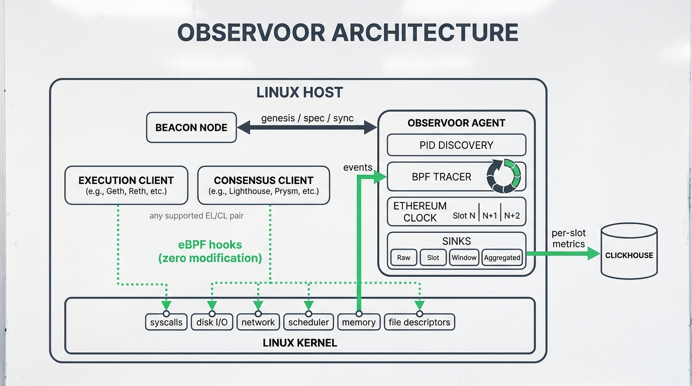

#  observoor

eBPF agent that monitors Ethereum execution and consensus layer processes at the kernel level. Captures syscalls, disk I/O, network I/O, scheduler events, memory faults, and file descriptor activity — aggregated per slot and exported via ClickHouse. Zero client modifications required. Linux only.

## Architecture



## Supported Clients

**Execution Layer:** Geth, Reth, Besu, Nethermind, Erigon

**Consensus Layer:** Prysm, Lighthouse, Teku, Lodestar, Nimbus

## Event Types

| Type | Description |
|------|-------------|
| `syscall_read` | read() syscall with latency |
| `syscall_write` | write() syscall with latency |
| `syscall_futex` | futex() syscall with latency |
| `syscall_mmap` | mmap() syscall with latency |
| `syscall_epoll_wait` | epoll_wait() syscall with latency |
| `syscall_fsync` | fsync() syscall with latency |
| `syscall_fdatasync` | fdatasync() syscall with latency |
| `syscall_pwrite` | pwrite64() syscall with latency |
| `disk_io` | Block I/O read/write with latency and byte count |
| `block_merge` | Block I/O request merge |
| `net_tx` | TCP send with byte count, ports, and inline RTT/cwnd metrics |
| `net_rx` | TCP receive with byte count and ports |
| `tcp_retransmit` | TCP retransmission with byte count and ports |
| `tcp_state` | TCP state transition with ports |
| `sched_switch` | Context switch with on-CPU time |
| `sched_runqueue` | Runqueue/off-CPU latency for scheduled threads |
| `page_fault` | Page fault (major/minor) |
| `fd_open` | File descriptor opened |
| `fd_close` | File descriptor closed |
| `mem_reclaim` | Direct reclaim latency |
| `mem_compaction` | Compaction latency |
| `swap_in` | Swap-in event |
| `swap_out` | Swap-out event |
| `oom_kill` | OOM kill event |
| `process_exit` | Process exit with exit code |
| `memory_usage` | Per-process memory snapshot (VmSize, VmRSS, RssAnon, RssFile, RssShmem, VmSwap) |

## Configuration

See [`example.config.yaml`](example.config.yaml) for a complete configuration reference.

Tiered per-metric aggregation intervals can be configured with
`sinks.aggregated.resolution.overrides`:

```yaml
sinks:
  aggregated:
    resolution:
      interval: 100ms
      overrides:
        - metrics: [syscall_futex, sched_runqueue, mem_reclaim, mem_compaction]
          interval: 500ms
        - metrics: [page_fault_major, page_fault_minor, swap_in, swap_out, oom_kill, fd_open, fd_close, process_exit, tcp_state_change]
          interval: 1s
```

If `overrides` is omitted, all metrics use `resolution.interval`.

## Query-Layer Reconstruction for Sampled Metrics

By default, Observoor retains 100% of events (`sampling.mode=none`, `sampling.rate=1.0`).
This section applies when you explicitly enable sampling.

When sampling is enabled, stored rows contain sampled aggregates, not pre-scaled estimates.
Use `sampling_rate` at query time to reconstruct additive totals.

- `estimated_sum = sum / sampling_rate`
- `estimated_count = count / sampling_rate`
- `estimated_mean = sum(sum / sampling_rate) / sum(count / sampling_rate)`

Example: reconstruct counter totals (bytes + events) from `net_io`:

```sql
SELECT
    toStartOfMinute(window_start) AS ts,
    sum(`sum` / sampling_rate) AS estimated_bytes,
    sum(count / sampling_rate) AS estimated_events
FROM net_io
WHERE meta_network_name = 'mainnet'
  AND window_start >= now() - INTERVAL 1 HOUR
GROUP BY ts
ORDER BY ts;
```

Example: reconstruct latency mean from `syscall_futex`:

```sql
SELECT
    toStartOfMinute(window_start) AS ts,
    sum(`sum` / sampling_rate) / nullIf(sum(count / sampling_rate), 0) AS estimated_mean_ns
FROM syscall_futex
WHERE meta_network_name = 'mainnet'
  AND window_start >= now() - INTERVAL 1 HOUR
GROUP BY ts
ORDER BY ts;
```

Notes and caveats:

- This reconstruction is appropriate for additive stats (`sum`, `count`) and means derived from them.
- `min`/`max` are sampled extrema and are not exactly reconstructable.
- Exact quantiles are not reconstructable from sampled rows; weighted histogram buckets can provide approximations.
- `sampling_mode='probability'` is generally better for unbiased estimation. `sampling_mode='nth'` can introduce workload-dependent bias in some dimensions.

## ClickHouse Migrations

Migrations live in `deploy/migrations/clickhouse/` and use [golang-migrate](https://github.com/golang-migrate/migrate) format.

Run with:

```bash
migrate -source file://deploy/migrations/clickhouse \
  -database 'clickhouse://localhost:9000/observoor' \
  up
```

## Building

```bash
# Requires Linux with kernel headers and libbpf
make build
```

## Benchmarking

Use the built-in performance suite to guard correctness, allocations, and CPU hot paths:

```bash
# Full blackbox + alloc + Criterion suite (cross-platform default: --no-default-features)
make perf-suite

# Criterion-only full run
make bench

# Fast Criterion smoke run
make bench-smoke
```

If you want to run benchmarks with default features (for Linux production parity), override:

```bash
make bench PERF_CARGO_ARGS=""
```

Pull requests also run `.github/workflows/perf-gate.yaml`, which compares `hot_paths`
against the PR base commit and fails on significant regressions in key throughput paths.

## Running

```bash
sudo ./observoor --config config.yaml
```

Root (or `CAP_BPF` + `CAP_PERFMON`) is required for eBPF program loading.
